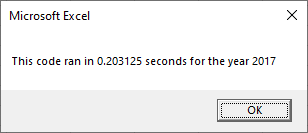

# Green Stock Analysis

## Overview
Steve would like to analyze the performance of various "green" stocks for his parents to help them make informed investing decisions.  The original code was written to compare a list of stocks for two different years.  The code was then refactored to make the script running faster so it can process many more stocks over several more years.    

## Results

Original Script | Refactored Script
----------------|------------------
 | 
 | 

### Stock Performance

 

### Summary

The refactored code ran significantly faster than the original code.  This would allow for an expanded use of the code for larger data sets.  Processing capability and the ability to clarify exisiting code is an advantage of refactoring code.  The disadvantage is getting stuck comparing the old code to the new code and reframing the approach.  It would almost be easier to start from scratch and be unemcumbered by an already working process.  
